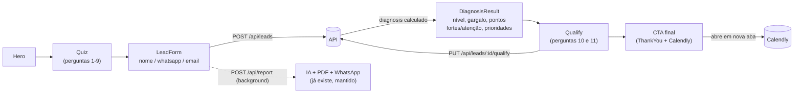

# Design — Diagnóstico de Maturidade e Crescimento (Escritórios de Advocacia)

## 1. Visão geral do novo funil



O funil de hoje é `Hero → Quiz → ResultForm (resultado + contato juntos) → ThankYou`. O novo funil separa claramente **captura de contato** (`LeadForm`) de **exibição do resultado** (`DiagnosisResult`), e insere duas etapas novas depois do resultado (`Qualify`, `CTA`) antes de chegar a uma tela final equivalente ao `ThankYou` atual.

---

## 2. Requisito 1 — Perguntas fixas do diagnóstico

### 2.1 As 11 perguntas do briefing mapeadas para o modelo de dados

| # | Pergunta | `type` | `category_slug` | `scored` | `allow_other` |
|---|---|---|---|---|---|
| 1 | Área de atuação | `texto_livre` | `area_atuacao` | não | não |
| 2 | Faturamento médio mensal | `escolha_unica` | `faturamento` | não | não |
| 3 | Quem é responsável pela captação/atendimento | `escolha_unica` | `estrutura_comercial` | **sim** | não |
| 4 | Como novos clientes chegam | `escolha_unica` | `geracao_demanda` | **sim** | não |
| 5 | Custo por lead / CAC | `escolha_unica` | `controle_custo` | **sim** | não |
| 6 | Processo de atendimento/qualificação/conversão | `escolha_unica` | `atendimento_conversao` | **sim** | não |
| 7 | Acompanhamento de números / previsão de faturamento | `escolha_unica` | `previsibilidade` | **sim** | não |
| 8 | Maior dificuldade hoje (gargalo autodeclarado) | `multipla_com_outra` | `gargalo_autodeclarado` | não* | **sim** |
| 9 | O que gostaria de descobrir | `escolha_unica` | `intencao_descoberta` | não | não |
| 10 | Nível de interesse em estruturar | `escolha_unica` | `intencao_compra` | não | não |
| 11 | Encaixe do investimento (R$ 2.500) | `escolha_unica` | `fit_investimento` | não | não |

\* A pergunta 8 não soma pontos ao score, mas **alimenta diretamente** o cálculo do gargalo principal (Requisito 2).

As perguntas 3–7 são as únicas que compõem o score de maturidade (5 eixos). As perguntas 1, 2, 9 são só segmentação/personalização. As perguntas 10 e 11 acontecem **depois** do resultado (Requisito 3), não durante o `Quiz`.

### 2.2 Mudança de schema — `questions`

Nova migration `add_type_fields_to_questions_table`:

```php
Schema::table('questions', function (Blueprint $table) {
    $table->enum('type', ['texto_livre', 'escolha_unica', 'multipla_com_outra'])->default('escolha_unica');
    $table->string('category_slug')->nullable(); // eixo fixo; null = não participa do cálculo
    $table->boolean('scored')->default(true);
    $table->boolean('allow_other')->default(false);
});
```

`category` (texto livre, label de exibição) é mantido como está hoje — `category_slug` é um campo novo e separado, usado só pelo motor de cálculo (Requisito 2), para não travar o admin a editar o label visível.

`options[].points` passa a aceitar `null` quando `scored = false` (a validação do `QuestionController` relaxa de `required` para `nullable` nesse caso).

### 2.3 Mudança no `Quiz.jsx`

Hoje o componente só sabe renderizar um tipo de tela: pergunta de escolha única com avanço automático ao clicar. Passa a decidir a UI por `question.type`:

- `escolha_unica`: comportamento atual, sem mudanças (clique → avança).
- `texto_livre`: input de texto + botão "Continuar" (avanço manual, precisa de texto não vazio).
- `multipla_com_outra`: checkboxes (permite mais de uma marcação) + botão "Continuar"; se "Outra" for marcada, exibe um campo de texto que se torna obrigatório.

O acumulador de respostas deixa de ser `number[]` (só pontos) e passa a ser um array de objetos:

```js
{ questionId, categorySlug, type, value, points, otherText }
// value: string (texto_livre) | number (índice da opção, escolha_unica) | number[] (índices marcados, multipla_com_outra)
```

Isso é o payload novo enviado em `POST /api/leads`.

---

## 3. Requisito 2 — Motor de diagnóstico

### 3.1 Onde vive o cálculo

Novo serviço backend `backend/app/Services/DiagnosisEngine.php`, chamado por `LeadController@store` **antes** de persistir o lead. Roda no servidor (não no navegador) para ser a fonte única de verdade — o mesmo objeto de diagnóstico pode alimentar o prompt da IA (`PromptBuilder`) no futuro, sem duplicar a lógica em dois lugares.

```php
class DiagnosisEngine
{
    // Eixos fixos, na ordem do briefing
    private const AXES = [
        'geracao_demanda', 'estrutura_comercial', 'controle_custo',
        'atendimento_conversao', 'previsibilidade',
    ];

    public function compute(array $answers): array
    {
        $axisScores = $this->extractAxisScores($answers);           // ['geracao_demanda' => 66, ...]
        $score      = (int) round(array_sum($axisScores) / count($axisScores));
        $level      = $this->levelFor($score);                      // 1..4
        $bottleneck = $this->bottleneckFor($answers, $axisScores);   // slug de 1 eixo
        $strengths  = $this->topAxes($axisScores, exclude: [], min: 66, limit: 2);
        $attention  = $this->topAxes($axisScores, exclude: [$bottleneck], limit: 2, ascending: true);

        return [
            'score'               => $score,
            'level'               => $level,
            'level_label'         => self::LEVEL_LABELS[$level],
            'bottleneck_category' => $bottleneck,
            'strengths'           => $strengths,
            'attention_points'    => $attention,
            'next_stage'          => self::NEXT_STAGE_COPY[$level],
            'priorities'          => $this->priorities($level, $bottleneck),
        ];
    }
}
```

### 3.2 Faixas de nível (reaproveita `DiagnosticReportService::levelFor()`)

| Score | Nível | Rótulo do briefing |
|---|---|---|
| < 25 | 1 | Dependente de Indicação |
| 25–49 | 2 | Em Estruturação |
| 50–74 | 3 | Em Crescimento |
| ≥ 75 | 4 | Previsível |

Mesmos cortes (75/50/25) já usados em `DiagnosticReportService::levelFor()` — só os rótulos mudam. Recomenda-se extrair essa função de corte para um local compartilhado (`LevelClassifier`) usado tanto pelo `DiagnosisEngine` (novo) quanto pelo `DiagnosticReportService` (existente), para não ter dois lugares com o número mágico `75/50/25`.

### 3.3 Mapeamento pergunta 8 → eixo (gargalo autodeclarado)

| Opção da pergunta 8 | Eixo mapeado |
|---|---|
| "Tenho dificuldade para gerar novos clientes" | `geracao_demanda` |
| "Minha entrada de clientes depende muito de indicação" | `geracao_demanda` |
| "Recebo contatos, mas poucos se tornam clientes" | `atendimento_conversao` |
| "Tenho dificuldade para organizar e acompanhar os interessados" | `atendimento_conversao` |
| "Invisto em marketing, mas não consigo entender o retorno" | `controle_custo` |
| "Tenho demanda, mas não tenho estrutura para crescer" | `estrutura_comercial` |
| "Outra: ___" | (sem mapeamento — cai no fallback) |

**Algoritmo do gargalo principal** (Requisito 2.2/2.3):
1. Pega os eixos mapeados pelas opções marcadas na pergunta 8 (ignora "Outra").
2. Se houver pelo menos um eixo mapeado, escolhe o de **menor pontuação** entre eles (o lead pode marcar 2 dificuldades; a mais crítica pelos números vence).
3. Se nenhuma opção mapeável foi marcada (só "Outra"), usa o eixo de menor pontuação entre os 5 eixos pontuados.

### 3.4 Conteúdo — rascunho v1 (sujeito a validação do cliente)

Este é o ponto que precisa de **sign-off de copy do cliente antes de ir para produção** — a estrutura/mecanismo está especificada, o texto abaixo é um rascunho de trabalho.

**Próximo estágio (por nível):**

| Nível | Texto (rascunho) |
|---|---|
| 1 | "Para sair da dependência de indicação, o próximo passo é estruturar um canal de aquisição próprio e um atendimento mínimo que não deixe contato sem resposta." |
| 2 | "Você já tem os primeiros processos. O próximo estágio é dar consistência: um funil de atendimento seguido sempre, não só quando dá tempo." |
| 3 | "Sua base é sólida. Para virar 'previsível', falta amarrar os números — saber hoje quanto vai faturar no mês que vem." |
| 4 | "Você já tem um motor previsível. Aqui o foco passa a ser otimização contínua e escala sem perder qualidade." |

**Prioridade geral (por nível)** + **Prioridade específica (por eixo-gargalo)** — combinadas em 2–3 bullets:

| Nível | Prioridade geral |
|---|---|
| 1 | Criar uma fonte de captação que não dependa de indicação |
| 2 | Documentar um processo mínimo de atendimento e triagem |
| 3 | Implementar acompanhamento semanal de funil e metas |
| 4 | Revisar gargalos de escala (equipe, capacidade de atendimento) |

| Eixo-gargalo | Prioridade específica |
|---|---|
| `geracao_demanda` | Estruturar um canal ativo de aquisição (tráfego/anúncios), não só indicação |
| `estrutura_comercial` | Definir quem é responsável por cada etapa (captação, atendimento, fechamento) |
| `controle_custo` | Passar a medir custo por lead e por contrato fechado |
| `atendimento_conversao` | Criar um processo de triagem e resposta rápida para todo novo contato |
| `previsibilidade` | Implementar um painel simples de acompanhamento de leads → contratos |

---

## 4. Requisito 3 — Qualificação pós-resultado e CTA de Calendly

### 4.1 Novo endpoint `PUT /api/leads/{id}/qualify`

```php
public function qualify(Request $request, Lead $lead): JsonResponse
{
    $data = $request->validate([
        'intencao_compra'   => 'required|string',
        'fit_investimento'  => 'required|string',
    ]);
    $lead->update($data);
    return response()->json($lead);
}
```

Rota pública (o lead ainda não está autenticado), mas só aceita atualizar esses dois campos — não reabre `name`/`phone`/`score`.

### 4.2 Link do Calendly (frontend)

```js
// src/config/brand.js (ou novo src/config/calendly.js)
const CALENDLY_URL = import.meta.env.VITE_CALENDLY_URL; // ex: https://calendly.com/g4business/diagnostico

function buildCalendlyLink({ name, email }) {
  if (!CALENDLY_URL) return null;
  const params = new URLSearchParams({ name: name || '', email: email || '' });
  return `${CALENDLY_URL}?${params.toString()}`;
}
```

O botão final abre `buildCalendlyLink(...)` com `target="_blank"`. Se `VITE_CALENDLY_URL` não estiver definido, o botão fica desabilitado com um texto tipo "Agendamento indisponível no momento" (Requisito 3.7) em vez de navegar para `undefined`.

### 4.3 Onde a tela de CTA final entra na máquina de estados

`Landing.jsx` ganha 2 views novas entre `RESULT` e `THANKYOU`:

```js
const VIEWS = { HERO, QUIZ, LEAD_FORM, RESULT, QUALIFY, THANKYOU };
```

`ThankYou.jsx` é reaproveitado como a tela final, com a copy trocada para o texto de oferta do briefing + botão de Calendly (em vez do texto genérico atual sobre "diagnóstico a caminho do WhatsApp" — esse aviso pode virar uma linha secundária dentro da mesma tela, já que o envio por WhatsApp continua acontecendo em paralelo).

### 4.4 Não bloquear o pipeline de IA/PDF/WhatsApp existente

A chamada a `reportApi.generate(...)` (hoje disparada em `Landing.jsx@handleSubmit`, fire-and-forget) permanece exatamente onde está — disparada assim que o lead é criado (`LEAD_FORM → RESULT`), independente do que acontece depois em `QUALIFY`/CTA. Nenhuma mudança é necessária no `ReportController`/`DiagnosticReportService` para este requisito (melhoria opcional de enriquecer o prompt com o `diagnosis` fica em "Fora de escopo").

---

## 5. Requisito 4 — Admin

### 5.1 `QuestionModal.jsx`

Adiciona um seletor de "Tipo" no topo do modal. Quando `type !== 'escolha_unica' && type !== 'multipla_com_outra'`, oculta a lista de respostas. Adiciona um toggle "Conta para o score de maturidade" (`scored`) que, quando desligado, oculta os inputs de pontos por opção (mostra só o texto do label). Quando a pergunta já tem um `category_slug` de um dos 5 eixos fixos (`geracao_demanda`, `estrutura_comercial`, `controle_custo`, `atendimento_conversao`, `previsibilidade`), o seletor de eixo e o toggle "pontua" ficam **desabilitados**, com uma nota explicando que essa pergunta é usada no cálculo do diagnóstico.

### 5.2 `LeadsPanel.jsx`

Novas colunas na tabela: **Nível** (badge N1–N4, cor por faixa, reaproveitando `scoreColor`), **Gargalo** (label do eixo), **Intenção** e **Fit investimento** (texto curto das respostas 10/11). `LeadController@exportXlsx` ganha as mesmas colunas no XLSX.

### 5.3 `resetDefaults()` (`QuestionController`)

O array `$defaults` hardcoded hoje (9 perguntas genéricas) é substituído pelas 11 perguntas do briefing, já com `type`, `category_slug`, `scored` e `allow_other` corretos — este é o novo "seed padrão" do sistema.

---

## 6. Contrato de API (resumo das mudanças)

| Método | Rota | Status | Mudança |
|---|---|---|---|
| GET | `/api/questions` | existente | resposta ganha `type`, `category_slug`, `scored`, `allow_other` por pergunta |
| POST | `/api/leads` | existente | payload de `answers` muda de formato (Requisito 1.3); resposta passa a incluir `diagnosis: {...}` (Requisito 2.7) |
| PUT | `/api/leads/{id}/qualify` | **novo** | grava `intencao_compra` e `fit_investimento` |
| POST | `/api/report` | existente | sem mudança de contrato nesta spec (mantido como está) |
| POST | `/api/admin/questions` , `/admin/questions/{id}` | existente | validação aceita os novos campos (`type`, `category_slug`, `scored`, `allow_other`) |

## 7. Dependências novas

- Nenhuma lib nova no backend (tudo é lógica PHP simples + Eloquent, já usado).
- Nenhuma lib nova no frontend (checkboxes/input de texto são HTML nativo, seguindo o estilo inline já usado em `Quiz.jsx`).
- Único insumo externo: **URL de agendamento do Calendly** do cliente (`VITE_CALENDLY_URL`), a ser fornecida antes do deploy.

## 8. Riscos e trade-offs

- **Copy do diagnóstico (Seção 3.4) é um rascunho**, não texto final aprovado — precisa de validação do cliente antes de ir para produção; o mecanismo de cálculo funciona independentemente do texto exato escolhido.
- **Travar `category_slug`/`scored` no admin (5.1) reduz a flexibilidade** que o admin tem hoje de criar categorias livres — é uma troca consciente: sem isso, um admin poderia editar uma pergunta de eixo fixo e quebrar silenciosamente o cálculo de nível/gargalo. Perguntas fora dos 5 eixos fixos continuam livres para criar/editar/remover normalmente (não entram no score).
- **Migração de dados**: leads já existentes no banco (respostas no formato antigo, `number[]`) não têm `level`/`bottleneck_category`/etc. — ficam com esses campos `null` no admin; não há necessidade de recalcular retroativamente (fora de escopo), mas o `LeadsPanel` precisa tratar `null` graciosamente (exibir "—" em vez de quebrar).
- **Pergunta 8 (múltipla escolha) muda o formato de `answers`** de um jeito que não é mais "um score por pergunta" — isso é a maior mudança estrutural desta spec e afeta `Quiz.jsx`, `LeadController@store`, `DiagnosisEngine` e potencialmente o prompt da IA (`PromptBuilder`) se ele inspecionar `answers` diretamente hoje (checar ao implementar).
