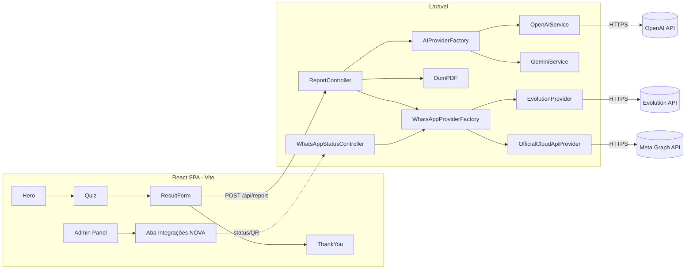

# Design — SEO, Provider de WhatsApp e Diagnóstico com IA

## 1. Visão geral

Três frentes independentes, mas que compartilham um objetivo: preparar o funil de diagnóstico da G4 para produção real — visível para buscadores/redes sociais, resiliente na entrega do resultado, e flexível na escolha de fornecedores (IA e WhatsApp).



---

## 2. Requisito 1 — SEO

### 2.1 Decisão de arquitetura

O app é uma SPA de funil curto (Hero → Quiz → Form → ThankYou), não um site de conteúdo. SSR completo (Next.js) seria overkill e uma reescrita grande. A abordagem recomendada é **prerender estático da rota `/` em build-time** + **meta tags corretas servidas estaticamente**, mantendo Vite + React Router como estão.

| Opção | Esforço | Cobertura | Recomendação |
|---|---|---|---|
| SSR completo (migrar p/ Next/Remix) | Alto (reescrita) | Total | Não recomendado agora |
| Prerender build-time (`vite-plugin-prerender` ou script próprio com Puppeteer) só na rota `/` | Baixo-médio | Cobre o crawler de busca e o link preview | **Recomendado** |
| Só meta tags estáticas no `index.html` (sem prerender do conteúdo) | Muito baixo | Cobre link preview (og:image/title/description), não cobre "ver conteúdo sem JS" | Mínimo aceitável se prazo for curto |

Dado que o requisito 1.9 é condicional ("SE decidir não investir em SSR completo"), o design assume a rota do meio: **meta tags estáticas completas (obrigatório) + prerender leve da Home (recomendado, não bloqueante)**.

### 2.2 Mudanças no `index.html`

Adicionar bloco de meta tags estático (title, description, canonical, Open Graph, Twitter Card, JSON-LD `Organization`). O `og:image` precisa de um asset novo (1200x630) — hoje só existe `favicon.svg`; será necessário criar/receber uma imagem de compartilhamento.

### 2.3 Novos arquivos estáticos em `public/`

- `public/robots.txt` — `Allow: /`, `Disallow: /admin`, aponta para o sitemap.
- `public/sitemap.xml` — lista apenas `/` (site de página única do ponto de vista de conteúdo público).
- `public/og-image.png` (ou `.jpg`) — 1200x630.

### 2.4 `noindex` no admin

Como `/admin/*` é roteado 100% client-side (mesmo `index.html` para todas as rotas via SPA fallback), a forma confiável de bloquear indexação é:
- `robots.txt` com `Disallow: /admin` (primeira linha de defesa, mas não impede indexação se alguém linkar).
- Middleware/regra no servidor (Nginx/Apache ou o próprio Laravel, se ele servir o build do Vite) que injeta `X-Robots-Tag: noindex, nofollow` no header de resposta quando o path começa com `/admin`. Se o frontend for servido por um static host (Vercel/Netlify/Nginx puro) sem Laravel na frente, a regra vai no `vercel.json`/`nginx.conf` equivalente — depende de como o deploy do frontend é feito hoje (não há evidência disso no repo, precisa confirmar com o usuário no momento da implementação).

### 2.5 Core Web Vitals

Ações de baixo esforço: `vite.config.js` sem build customizations hoje — adicionar `build.rollupOptions` para code-splitting já é default do Vite; o ponto real de atenção é o Google Fonts carregado via `<link>` bloqueante (já usa `preconnect`, ok) e ausência de `width`/`height`/`loading="lazy"` em imagens (hoje não há `` na Hero, é tudo SVG inline — baixo risco). Validar com Lighthouse após o prerender.

---

## 3. Requisito 2 — Provider de WhatsApp (Evolution x Oficial)

### 3.1 Abstração de provider (backend)

Criar uma interface e dois adapters, substituindo o uso direto de `WhatsAppService`:

```
backend/app/Services/WhatsApp/
  WhatsAppProviderInterface.php   // sendText, sendDocument, isEnabled, getStatus, getConnectionAction()
  EvolutionProvider.php           // implementação atual, movida de WhatsAppService.php
  OfficialCloudApiProvider.php    // nova, fala com Graph API (graph.facebook.com/v20.0/{phone_number_id}/messages)
  WhatsAppProviderFactory.php     // lê config('services.whatsapp.provider') e resolve o adapter
```

`WhatsAppProviderInterface`:
```php
interface WhatsAppProviderInterface {
    public function isEnabled(): bool;
    public function sendText(string $phone, string $message): bool;
    public function sendDocument(string $phone, string $base64Pdf, string $filename, string $caption = ''): bool;
    public function connectionStatus(): array; // ['connected' => bool, 'detail' => string, 'meta' => [...]]
}
```

`ReportController` passa a depender de `WhatsAppProviderInterface` (resolvido pelo factory via container binding em `AppServiceProvider`), não mais de `WhatsAppService` concreto. Isso mantém o restante do `ReportController` praticamente inalterado (Requisito 3 fica desacoplado do Requisito 2).

### 3.2 Config

`backend/config/services.php`:
```php
'whatsapp' => [
    'provider' => env('WHATSAPP_PROVIDER', 'evolution'), // evolution | official
],
'evolution' => [ ...já existe... ],
'whatsapp_cloud' => [
    'token'            => env('WHATSAPP_CLOUD_TOKEN'),
    'phone_number_id'  => env('WHATSAPP_CLOUD_PHONE_NUMBER_ID'),
    'waba_id'          => env('WHATSAPP_CLOUD_WABA_ID'),
    'verify_token'     => env('WHATSAPP_CLOUD_VERIFY_TOKEN'),
],
```

### 3.3 Evolution — fluxo de conexão (QR Code)

A Evolution API expõe endpoints de instância (`/instance/connect/{instance}` retorna o QR em base64, `/instance/connectionState/{instance}` retorna o status). Novo endpoint backend:

- `GET /api/admin/whatsapp/status` → chama o provider ativo e retorna `{ provider, connected, qrCode?, detail }`.
- `POST /api/admin/whatsapp/connect` → (só faz sentido para Evolution) dispara `/instance/connect/{instance}` e retorna o QR code em base64 para o frontend renderizar como ``.

Frontend (`Admin/IntegracoesPanel.jsx`, nova aba): ao entrar na tela, chama `GET status`; se `provider === 'evolution'` e `connected === false`, mostra botão "Conectar" → chama `POST connect` → exibe QR → faz polling em `GET status` a cada poucos segundos até `connected === true`.

### 3.4 Oficial (Meta Cloud API) — fluxo de "testar conexão"

Não existe pareamento por QR na Cloud API oficial — a conexão é feita via App do Meta Business Manager fora do sistema; o que o admin precisa aqui é **validar** que o token/phone number ID configurados no `.env` são válidos. `connectionStatus()` do `OfficialCloudApiProvider` faz um `GET https://graph.facebook.com/v20.0/{phone_number_id}?fields=display_phone_number,verified_name` com o Bearer token e retorna nome/número verificado, ou o erro da Meta.

Envio de mensagens usa `POST /{phone_number_id}/messages` com `type: text` e, para o PDF, `type: document` (a Cloud API exige upload prévio via `/media` antes de referenciar o `media_id` na mensagem — diferente da Evolution, que aceita base64 direto). Isso é encapsulado dentro de `OfficialCloudApiProvider::sendDocument()`.

### 3.5 Nova aba "Integrações" no admin (frontend)

- `src/pages/Admin/IntegracoesPanel.jsx` (novo, seguindo o padrão visual de `ProfilePanel.jsx`).
- Novo item em `Sidebar.jsx` e nova rota em `AdminPanel.jsx` (`tab === 'integracoes'`).
- `src/services/api.js`: novo namespace `whatsappApi = { status(), connect() }`.

### 3.6 Segurança

Nenhum endpoint de status/connect deve retornar `token`/`apikey` cru — só booleans e strings já mascaradas (ex.: `+55 11 9****-1234`). Rotas ficam dentro do grupo `auth:api` + `prefix('admin')` já existente em `routes/api.php`.

---

## 4. Requisito 3 — Diagnóstico com OpenAI + PDF + WhatsApp

### 4.1 Abstração de provider de IA

Mesmo padrão do WhatsApp, para não deixar o Gemini "morto" e permitir rollback fácil:

```
backend/app/Services/AI/
  AIReportProviderInterface.php   // generateReport(array $data): string
  OpenAIService.php                // novo — implementa a interface
  GeminiService.php                // existente — passa a implementar a interface, sem mudar lógica interna
  AIProviderFactory.php            // lê config('services.ai.provider'), default 'openai'
```

`OpenAIService` chama `POST https://api.openai.com/v1/chat/completions` (ou `responses`), reaproveitando integralmente o `buildPrompt()` já existente no `GeminiService` (mover para uma trait/base class compartilhada `PromptBuilder` para não duplicar as ~60 linhas de prompt).

`config/services.php`:
```php
'ai' => ['provider' => env('AI_PROVIDER', 'openai')],
'openai' => ['key' => env('OPENAI_API_KEY'), 'model' => env('OPENAI_MODEL', 'gpt-4o-mini')],
```

### 4.2 `ReportController` — mudanças mínimas

Troca o type-hint do construtor de `GeminiService` para `AIReportProviderInterface` (resolvido pelo factory) e de `WhatsAppService` para `WhatsAppProviderInterface` (Requisito 2). O corpo do método `generate()` muda muito pouco — o fallback estático (`fallbackReport()`) é preservado exatamente como está.

### 4.3 Rastreabilidade de entrega (nova migration)

```php
Schema::table('leads', function (Blueprint $table) {
    $table->timestamp('report_generated_at')->nullable();
    $table->string('ai_provider_used')->nullable();
    $table->enum('whatsapp_status', ['pending', 'sent', 'failed', 'disabled'])->default('pending');
    $table->text('whatsapp_error')->nullable();
});
```

`ReportController@generate` passa a receber também o `lead_id` (o frontend já tem o lead salvo antes de chamar `/report` — hoje ele não manda o id de volta; pequeno ajuste em `LeadController@store` para retornar o `id` criado, e em `Landing.jsx` para repassar no payload de `/report`). Ao final do fluxo, `ReportController` atualiza o `Lead` correspondente com os novos campos.

### 4.4 Exibição no `LeadsPanel`

`src/pages/Admin/LeadsPanel.jsx` ganha duas colunas/badges: "PDF" (gerado/não) e "WhatsApp" (enviado/falhou/pendente/desabilitado), com um botão "Reenviar" quando `whatsapp_status === 'failed'` chamando um novo endpoint `POST /api/admin/leads/{lead}/resend-report` que reexecuta apenas a etapa de envio (reaproveita o PDF já gerado, sem gastar tokens de IA de novo — para isso, o PDF gerado precisa ser persistido em disco/storage, não só devolvido em base64 efêmero).

Isso implica um ajuste adicional: salvar o PDF em `storage/app/reports/{lead_id}.pdf` (via `Storage::put`) no momento da geração, para permitir reenvio sem reprocessar a IA.

### 4.5 Timeout / fila assíncrona (Requisito 3.9)

MVP: manter síncrono (já é assim hoje e funciona para volume baixo/médio de leads). Ponto de atenção: `Http::timeout(60)` no Gemini e chamadas HTTP à Evolution/Meta somadas podem passar de 30-60s. Recomendação de design (não obrigatória para o MVP, listada como tarefa condicional):
- Extrair o corpo de `generate()` para um `Job` (`GenerateDiagnosticReportJob`) despachado via `QUEUE_CONNECTION` (hoje `sync` no `.env.example` — trocar para `database` ou `redis` em produção).
- `POST /api/report` passa a retornar `202 Accepted` com um `report_id`; frontend faz polling em `GET /api/report/{id}` até o status virar `done`, então dispara o download do PDF.
- Essa mudança quebra o contrato atual do endpoint (hoje retorna o PDF direto) — por isso fica marcada como **opcional/fase 2** nas tasks, não obrigatória para destravar o requisito principal.

---

## 5. Contrato de API (resumo das mudanças)

| Método | Rota | Status | Mudança |
|---|---|---|---|
| POST | `/api/report` | existente | passa a usar `AIProviderFactory` + `WhatsAppProviderFactory`; aceita `lead_id` opcional |
| POST | `/api/admin/leads/{lead}/resend-report` | novo | reenvia PDF já persistido via provider ativo |
| GET | `/api/admin/whatsapp/status` | novo | status de conexão do provider ativo |
| POST | `/api/admin/whatsapp/connect` | novo | inicia pareamento (Evolution) / no-op informativo (Official) |

## 6. Dependências novas

- Backend: nenhuma lib nova obrigatória (OpenAI e Graph API são chamadas via `Illuminate\Support\Facades\Http`, já usado). Opcional: `openai-php/laravel` se preferir SDK oficial em vez de `Http::post` cru.
- Frontend: nenhuma lib nova obrigatória para SEO básico. Se optar por prerender build-time, avaliar `vite-plugin-prerender` ou script Puppeteer no `postbuild`.

## 7. Riscos e trade-offs

- **Prerender vs SSR**: prerender cobre só a rota `/` estática; se o funil evoluir para múltiplas rotas indexáveis, reavaliar SSR real.
- **Reenvio de WhatsApp exige persistir PDF em disco** — aumenta uso de storage; recomenda-se rotina de limpeza (ex.: apagar PDFs com mais de 90 dias) fora do escopo desta spec.
- **Fila assíncrona (4.5)** é a mudança de maior risco de regressão porque altera o contrato do endpoint consumido pelo frontend — tratar como fase separada, não bloquear o restante da spec por causa dela.
